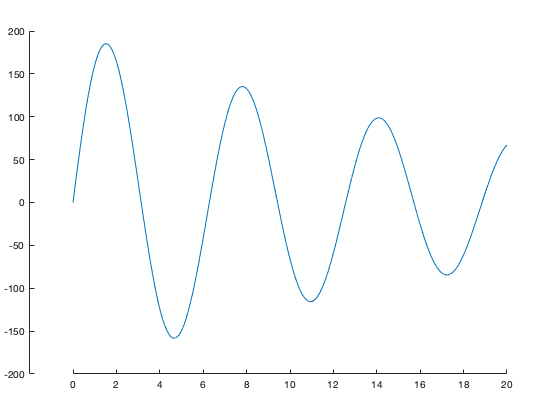
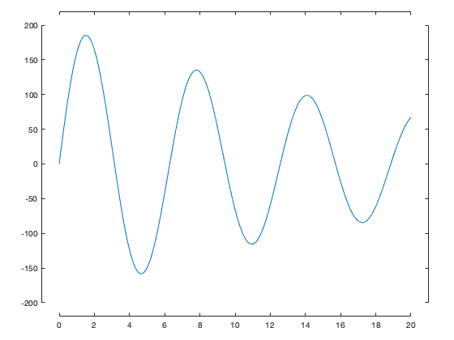
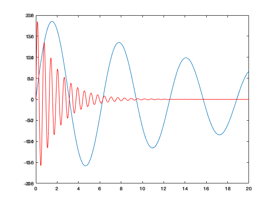
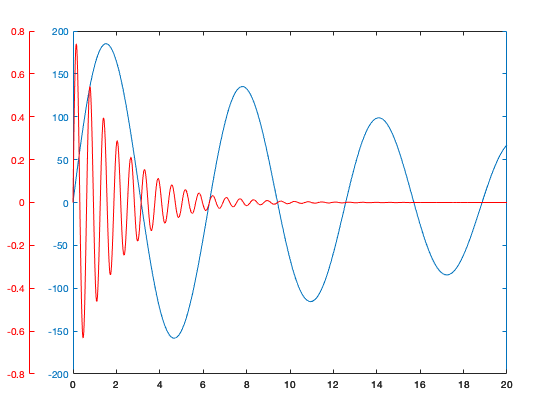
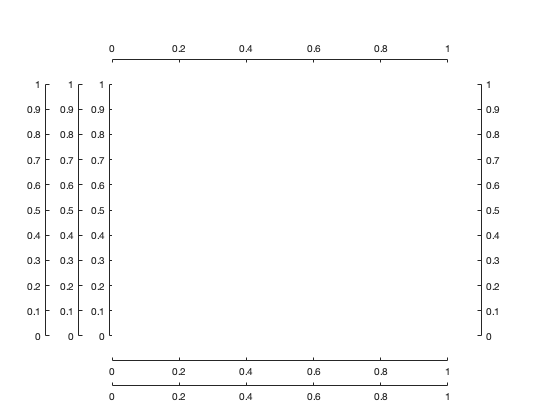

# offsetaxis.m: Offset an x- or y-axis from the plotted axis area


Author: Kelly Kearney
[](https://www.mathworks.com/matlabcentral/fileexchange/97557-offsetaxis)

This repository includes the code for the `offsetaxis.m` Matlab function, along with all dependent functions required to run it.


The `offsetaxis` function allows one to move the visible axis away from the plotted axis area.  This is often done to allow for multiple axes associated with a single graph, or to simply create a less cluttered appearance along the edges of plotted data.  It achieves this appearance by creating a second, mostly-hidden-except-for-the-axis-line axis that is linked to the original axis.


## Contents

            
- Getting started        
- Syntax        
- Example 1: Axis offset positions        
- Example 2: More flexible multi-axis plots

## Getting started


**Prerequisites**


This function should be compatible with all versions of Matlab.


**Downloading and installation**


This code can be downloaded from [Github](https://github.com/kakearney/offsetaxis-pkg/) or the [MatlabCentral File Exchange](https://www.mathworks.com/matlabcentral/fileexchange/97557-offsetaxis).  The File Exchange entry is updated daily from the GitHub repository.


**Matlab Search Path**


The following folders need to be added to your Matlab Search path (via `addpath`, `pathtool`, etc.):


```matlab
offsetaxis-pkg/offsetaxis
```


## Syntax


`offsetaxis(ax)` adds an offset y-axis to the axis or axes indicated by the handle(s) `ax`, displaced 0.1 axis-width units from the original axis.


`offsetaxis(ax, ..., 'y', yoffset)` adds an offset y-axis to the axis indicated by the handle `ax`, displaced by a custom distance `yoffset` that is defined as a fraction of the axis width.  Default is 0.1 if no x-offset is specified, and 0 otherwise.


`offsetaxis(ax, ..., 'x', xoffset)` adds an offset x-axis to the axis indicated by the handle `ax`, displaced by a custom distance `xoffset` that is defined as a fraction of the axis height. Default is 0.


`offsetaxis(ax, ..., 'yloc', yloc)` indicates where the offset y-axis should be placed ('l' = left, 'r' = right, 'lr' = both).  Default is 'l'.


`offsetaxis(ax, ..., 'xloc', yloc)` indicates where the offset x-axis should be placed ('t' = top, 'b' = bottom, 'tb' = both).  Default is 'b'.


`hy = offsetaxis(...)` returns the handles to the newly-created axis objects used to display offset y-axes.  `hy` will be the same dimensions as `ax`, and is only returned if a y-offset is specified by input.


`hx = offsetaxis(...)` returns the handles to the newly-created axis objects used to display offset x-axes.  `hx` will be the same dimensions as `ax`, and is only returned if a x-offset is specified by input.


## Example 1: Axis offset positions


The following example demonstrates the default location of an offset y-axis.


```matlab
x = 0:0.01:20;
y1 = 200*exp(-0.05*x).*sin(x);

figure;
ax = axes;
hold on;
plot(x, y1);
offsetaxis(ax); % Default, y-offset = 0.1 and yloc = 'l'
```




Offset axes can also be added in any direction.


```matlab
figure;
ax = axes;
plot(x, y1);
offsetaxis(ax, 'y', 0.05, 'x', 0.05, 'yloc', 'lr', 'xloc', 'tb');
```





## Example 2: More flexible multi-axis plots


Matlab includes a few helper functions to allow plotting of data on different scales on the same axes.  These functions include `plotyy` in older versions, and `yyaxis` in newer versions.  There are also numerous File Exchange entries designed to extend these functions to more data types, more axes, and to the x-axis (plotyyy, plots, etc.).  These functions rely on the same underlying concept as `offsetaxis` (i.e. creating extra axes).  However, the lower-level control offered by offset axis to control all aspects of this type of plot allows you to manually build more complex multi-axis plots.


In this example, we demonstrate some of the concepts needed to create this sort of plot.  We'll use the same data as the `plotyy` documentation:


```matlab
x = 0:0.01:20;
y1 = 200*exp(-0.05*x).*sin(x);
y2 = 0.8*exp(-0.5*x).*sin(10*x);

figure % new figure
plotyy(x,y1,x,y2);
```


The first step to creating our new figure is to create two axes on top of each other.  We then add one line to each plot.  Note that we need to manually remove the color from the top axis to make sure we can see through to the bottom one (and set the hold state, since a call to plot or other high-level plotting functions will reset this if the hold state is off).


```matlab
figure;

% Create two axes on top of each other

ax1 = axes;
ax2 = axes('position', ax1.Position, 'color', 'none');
hold(ax2, 'on');

% Plot data to their respective axes:

ln1 = plot(ax1, x, y1);
ln2 = plot(ax2, x, y2, 'r');
```




Next, we add the offset axis.  It's also common to want to match the color of the axes to the plotted data, though this may vary for your particular needs.


```matlab
hy = offsetaxis(ax2, 'y', 0.1);
set(hy, 'YColor', ln2.Color);
set(ax1, 'YColor', ln1.Color);
```




As you can see, this method involves more work than a simple call to `plotyy` or `yyaxis` or any of the all-in-one File Exchange functions, but in exchange, you can gain more flexibility over the number of and location of additional axes.  You can add as many axes as needed in either the x- or y-directions!


```matlab
figure;
ax = axes('position', [0.2 0.2 0.6 0.6]);
offsetaxis(ax, 'y', 0.01);
offsetaxis(ax, 'y', 0.1);
offsetaxis(ax, 'y', 0.2);
offsetaxis(ax, 'y', 0.1, 'yloc', 'r');
offsetaxis(ax, 'x', 0.1);
offsetaxis(ax, 'x', 0.2);
offsetaxis(ax, 'x', 0.1, 'xloc', 't');
set(ax, 'box', 'on');
```





<sub>[Published with MATLAB R2019a]("http://www.mathworks.com/products/matlab/")</sub>
